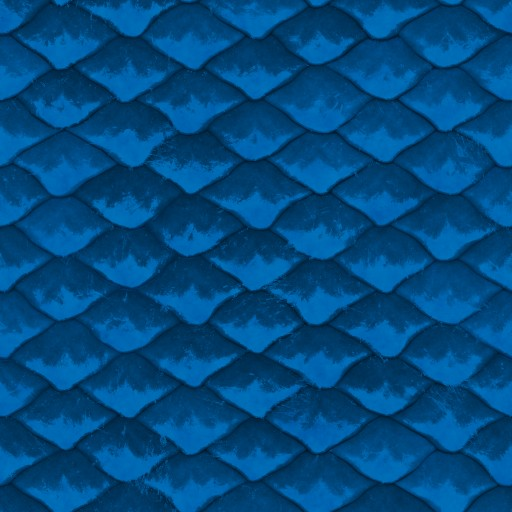
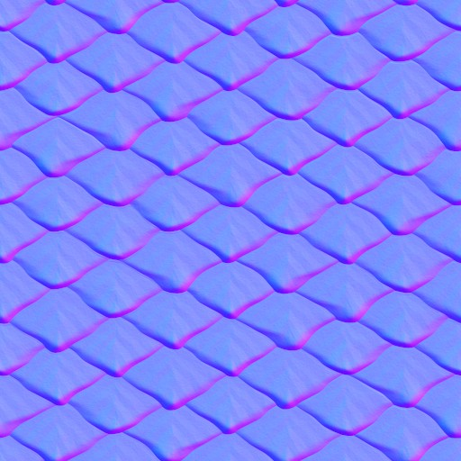
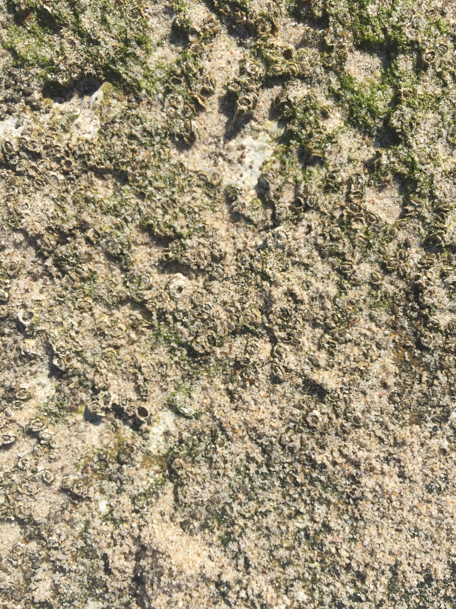
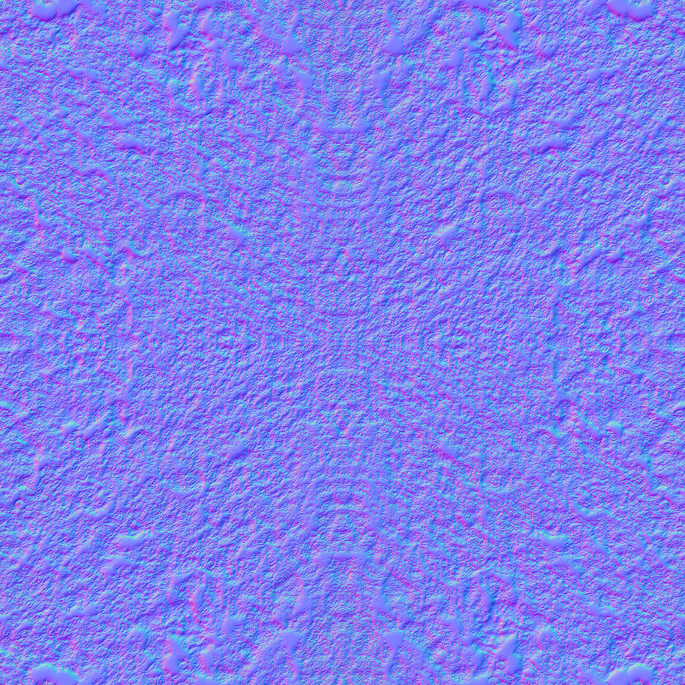
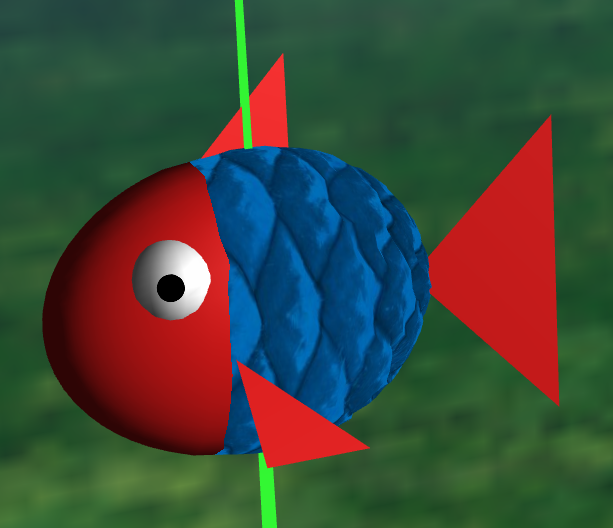
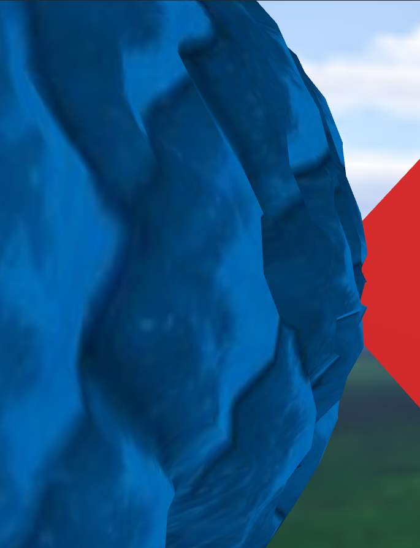
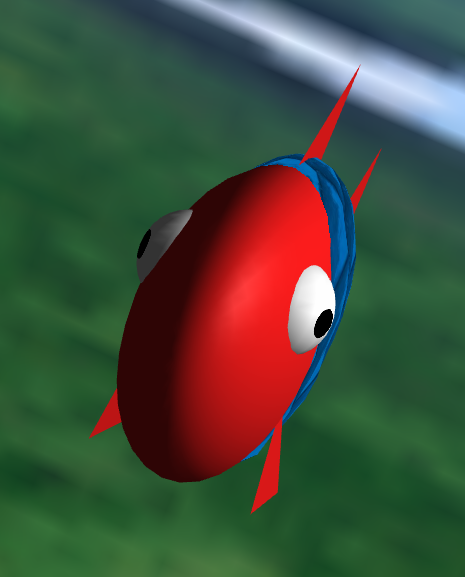
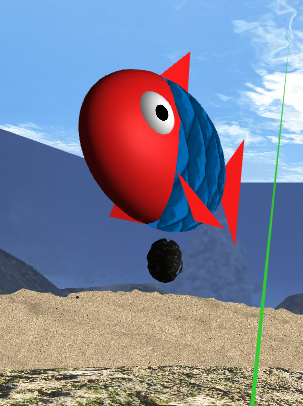
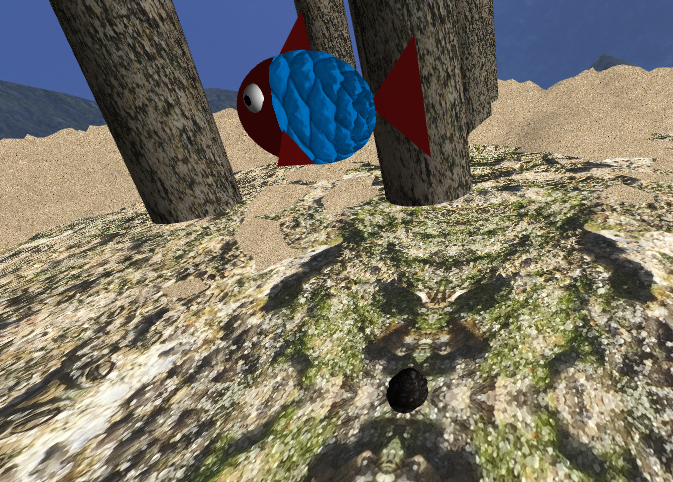
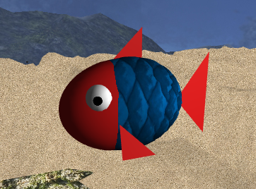

# CGRA 2020/2021

## Group T4xG11

## Project Notes

In this project we opted to implement the functionalities of the points 7.1, 7.2 and 7.6

We implemented every functionality required by the project specification we noticed that our implementation of exercise 7.2 greatly impacts the program's performance.

## Sources

### the textures used in the fish body are free to use and where obtained from https://3dtextures.me/2019/07/24/dragon-scales-001/

### the textures for the fish nest are also free to use and come from https://everytexture.com/everytexture-com-stock-nature-mold-moss-texture-00014/

## Screenshots

### 1 - MyFish

